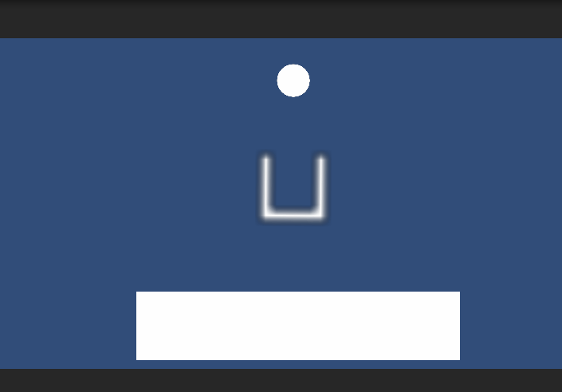
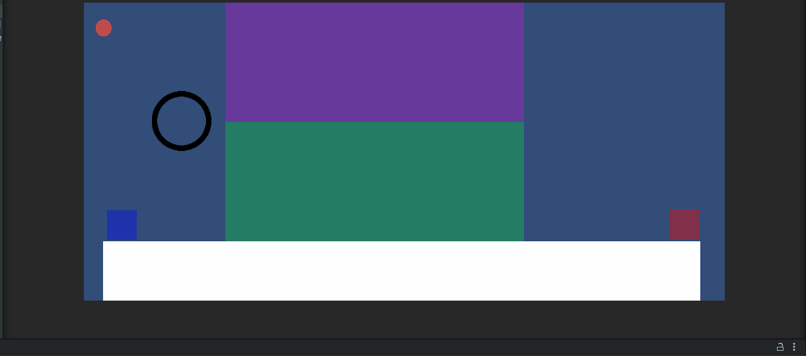
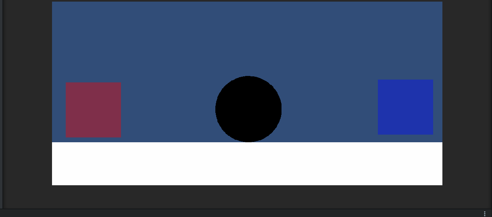
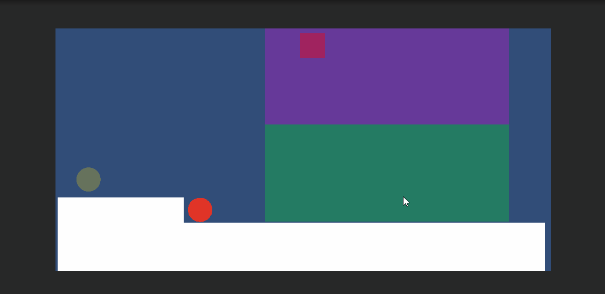

# GeometryLevel
A simple Unity demo.

# Main Concept
* Sprite - Collidier: [potrace](http://potrace.sourceforge.net/#license) is used here to generate polygon collider from the sprite.
  * 
* Mirror: Extend the idea above, the object in the mirror has a special collidier which is the part of the origin object in the mirror area.
  * 
* Active Transform: Since the collidier is generated dynamically, the sprite can be modified at any time.
  * 
  
# Level Demo
I made two levels to show how the concepts above can work in the level design. The goal in these levels is to let some red object collide with the golden ball.

# TODO
* Accelerating `MirroredWorker` by using CUDA.
* After building, it works strange.
* Use tilemap for level creating
* Make the camera follow the player

# Thanks
* [potrace](http://potrace.sourceforge.net/#license): Very handful and useful tracing algorighm & program.
* [inkscape](https://inkscape.org/): Simple but Powerful SVG editor.
